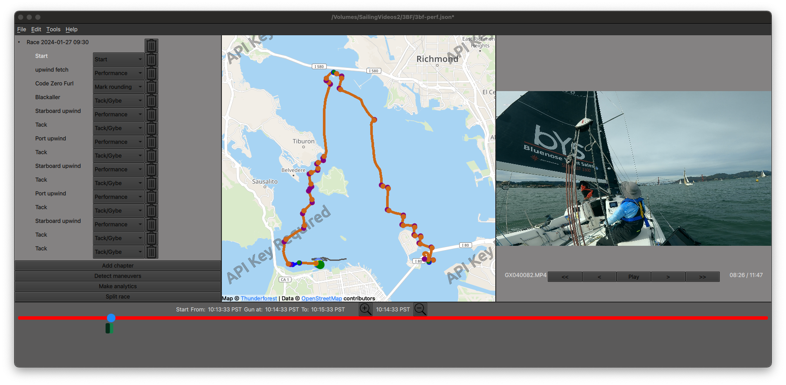
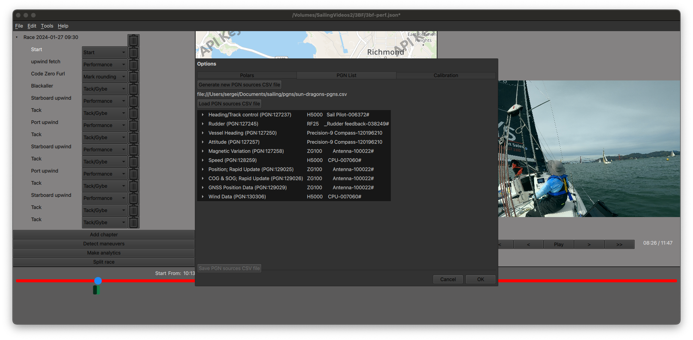

# Sailvue 

## Overview 
Sailvue is a video editor that does the following:
- Analyzes GoPro footage and automatically finds the time intervals containing maneuvers like tacks, gybes, marks roundings.
- The GUI allows the user to edit automatically detected time intervals, delete and add new ones.
- After user is satisfied with maneuver events, so-called performance intervals are created in between the maneuvers. The performance intervals are supposed to represent some particular point of sail.
- Once this breakdown is ready the video is produced. The performance intervals are rendered in time lapsed view, so regardless of the actual duration the screen time is 1 minute. The maneuvers are rendered in a real time.
- The instrument data is rendered as graphic overlays
  - Polar diagram overlay
  - Rudder angle and autopilot control overlay
  - Time lost to the boat sailing the targets 
  - Strip chart view of VMG and speed percentages to target values
  - Numerical readings of some instruments
  - During the start the race timer is shown
  
## Inputs
- GoPro videos containing the GPS data encoded as [GPMF](https://gopro.github.io/gpmf-parser/) data. In my case it's Hero 11 with GPS turned on.
- NMEA2000 data collected by [YDVR recorder](https://yachtdevicesus.com/products/voyage-recorder-ydvr-0).    

## Installation 
- This [GiHub Action](https://github.com/sergei/sailvue/actions/workflows/cmake-single-platform.yml) creates Mac installer DMG file
- These files can be downloaded from [Releases page](https://github.com/sergei/sailvue/releases)
- No binaries are available for Linux or Windows 

## Support 
No support is offered whatsoever, it's my pet project to create videos for Javelin and Sun Dragon.

## Screenshots

### Overview

### Options dialog

## Some videos created by sailvue 
 - [Three Bridges Fiasco](https://youtu.be/7mJTKAoThuE)
 